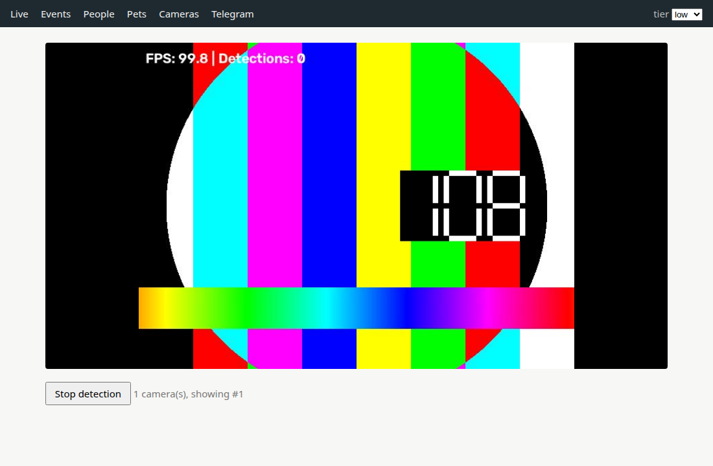
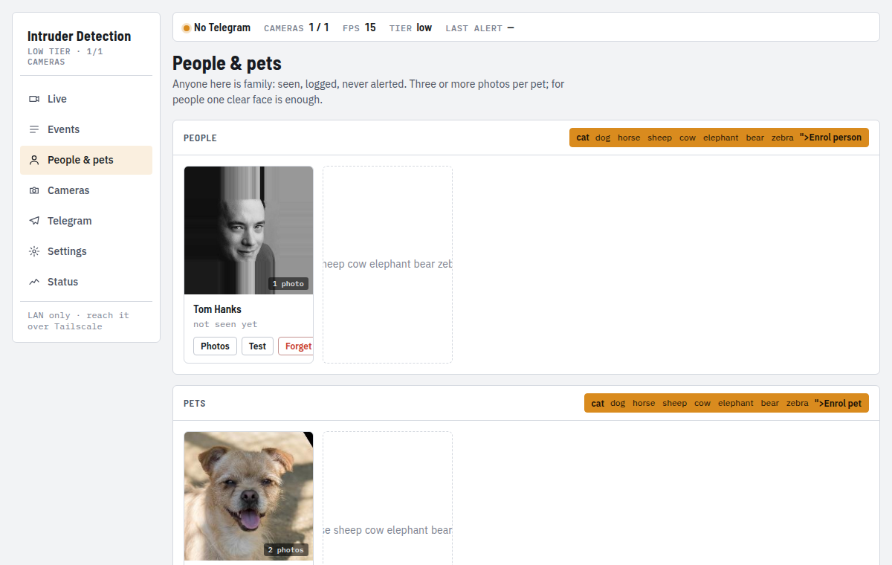
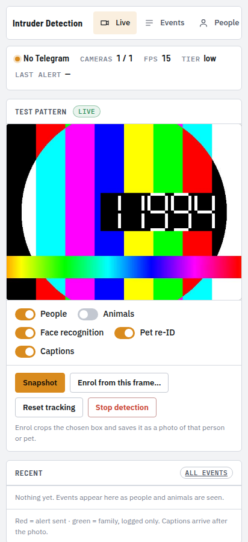

[](https://github.com/Junhui20/Intruder-Detection-System/actions/workflows/tests.yml)

# Everything Ring, Arlo and Google charge $100–200 a year for — familiar faces, AI event captions — running on your own hardware, zero subscription. Plus one thing they don't sell: recognising *your own* pet.

A local intruder-detection system for the home. A camera (an IP camera, an
RTSP stream, or an old phone running DroidCam) feeds a YOLO detector; people and
animals are matched against the faces and pets you enrolled; every alert goes
to Telegram with a short caption written by a local vision-language model.
Nothing leaves your LAN.

> Rebuilt in September 2026 from a 2025 tkinter project, one problem per
> commit, in [ten pull requests](../../pulls?q=is%3Apr+is%3Amerged). The
> original is tagged [`v1-tkinter`](../../tree/v1-tkinter).

## Two tiers, two proofs

The same features run in two model-size presets. **Low** proves that "local"
does not require good hardware. **High** proves that scaling up does not raise
the bill. Paid-tier features elsewhere — familiar faces, pet recognition, AI
captions — are available in *both* tiers; only capacity (camera count, live-view
protocol, retention) depends on the hardware.

| | **Low** | **High** |
|---|---|---|
| Reference hardware | same laptop, CPU only, 4 threads *(proxy for a Pi 5 / N100 mini PC)* | 2020 gaming laptop: i5-10500H, RTX 3050 4 GB |
| Detector | YOLO11n | YOLO11n (fp16 ONNX) |
| Face recognition | InsightFace `buffalo_sc` | InsightFace `buffalo_l` |
| Pet re-ID | `dinov2-small` | `dinov2-base` |
| Event captions | Ollama `qwen2.5vl:3b` | Ollama `qwen2.5vl:7b` |
| Detection, 1 camera, 640 px | **31 FPS** (32 ms) | **117 FPS** (9 ms) |
| Face-ID, one frame with 6 faces | 92 ms | 63 ms ¹ |
| Pet re-ID, one animal crop | 53 ms | 24 ms |
| Caption (photo goes out first; this is how late the caption arrives) | 76 s | 49 s ² |
| RAM, models loaded / under load | 1.1 GB / 1.1 GB | 1.5 GB / 1.5 GB (+ 0.4 GB VRAM) |
| Pi 5 / N100 (real numbers) | *contribute yours* | — |

`python bench.py speed --tier low|high` reproduces every row (median of 30
detections, 20 recognitions, 3 captions; a photo with six people). Per-feature
overrides live in `config.yaml`, so you can mix presets.

¹ `onnxruntime-gpu` did not bind CUDA in this environment (CUDA 13 libraries
from torch, ORT 1.30 wants 12), so face-ID ran on the CPU in both tiers.
² A 4 GB card is the problem here, not the model: with YOLO and DINOv2 already
resident, Ollama gets ~2.5 GB and spills the 7b (and even the 3b — 43 s) to the
CPU. Alone on the same card the 3b answers in 1.6 s. A ≥ 8 GB card is where the
high tier's caption model belongs; on 4 GB set `captions.model: qwen2.5vl:3b`
and accept ~40 s, or run captions on the CPU tier's budget.

Two things the benchmark settled: **YOLO26n is not faster than YOLO11n** here
(31 vs 31 FPS on the CPU, 104 vs 113 on the GPU), so the project stays on
YOLO11n; and the "optimised" ONNX exports are **2× slower than the plain `.pt`
on a CPU** (69–77 ms vs 34 ms), so they are now only used when a GPU is present.

## What it costs elsewhere

| | Familiar faces | AI captions | Price | In Malaysia |
|---|---|---|---|---|
| Google Home Premium | paid tier | Advanced only | $10/mo, $100/yr; Advanced $20/mo, $200/yr | not sold; ≈ RM407 / RM814 a year |
| Arlo Secure | Plus only | yes (Secure 6) | $7.99 single / $12.99 unlimited / Plus $17.99/mo | not sold; Plus ≈ RM878 a year |
| Ring Home Premium | yes | Video Descriptions | $20/mo, $200/yr | not sold; ≈ RM814 a year |
| TP-Link Tapo Care | Advanced AI tier | yes (summaries) | $3.49 basic / $19.99 Advanced AI per month | sold; RM price only in the app, ≈ RM814 a year at the US rate |
| EZVIZ CloudPlay | no | no | — | RM16.99–43.49/mo, RM170–435 a year (storage only) |
| Blue Iris | via add-on | via add-on | $69.95–$99.95 one-time (Windows NVR) | ≈ RM285–407 once |
| Frigate | yes (0.16+) | yes (0.15+) | free | free |
| **This project** | yes | yes (local VLM) | **free** | **free** |

For comparison, the hardware to run this locally, bought once: a Raspberry Pi 5
8 GB is **RM782** (Cytron, official reseller), a new Intel N100 mini PC
**RM800–1,400** on Shopee. Either costs less than one year of the cheapest
familiar-faces subscription, and nothing the year after.

USD prices verified September 2026; MYR at 4.07 per USD. Sources, dates and
the things that could not be verified are in
[docs/MALAYSIA_PRICES.md](docs/MALAYSIA_PRICES.md).

## Why not Frigate?

[Frigate](https://frigate.video) is free, excellent, and better than this
project at being an NVR: 24/7 recording, timeline, Home Assistant, hardware
accelerators. If you want an NVR, use Frigate. This project does not compete
with it. It is a smaller, opinionated alert system with one feature Frigate
does not have — recognising an individual pet rather than "a dog" — and a
codebase small enough to read in an afternoon, which is the point of a
portfolio piece.

## Features

- **Detection** — YOLO11n, person tracking, 8 animal classes
  (cat, dog, horse, sheep, cow, elephant, bear, zebra), configurable thresholds,
  timer-based alerts for unknown people.
- **Familiar faces** — enrol people from photos; alerts say who it was.
  InsightFace (SCRFD + ArcFace) on ONNX Runtime, `buffalo_sc` low / `buffalo_l` high.
- **Your own pet** — enrol a pet from three or more photos; alerts distinguish
  *your* dog from *a* dog. DINOv2 embeddings, cosine match, `dinov2-small` low /
  `dinov2-base` high. Numbers and the caveat in [Pet re-ID](#pet-re-id).
- **Event captions** — a local vision-language model writes one line under each
  alert photo ("Blond woman in a black dress, holding cards, facing the camera").
  Ollama with `qwen2.5vl:3b` (low) / `qwen2.5vl:7b` (high); the photo goes out first,
  the caption is edited in when ready. Off, silently, when Ollama is not running.
- **Cameras** — RTSP (any Tapo / Hikvision / Dahua / Reolink / ONVIF camera,
  vendor paths in [docs/CAMERA_SETUP.md](docs/CAMERA_SETUP.md)), HTTP MJPEG,
  DroidCam (an old phone as a camera), local webcam fallback, multi-camera.
- **Telegram** — alerts with photo and caption; `/status`, `/snapshot`,
  `/arm`, `/disarm`, `/mute 1h`; and `/enroll Name` as a reply to an alert
  photo, which makes that person or pet family without opening a browser.
- **Web UI** — live view with per-feature toggles, snapshot, and *enrol from
  this frame* (tap a box on the current picture); events with the alert photos
  and their captions; people and pets as cards with a *Test* button that scores
  the current frame against them; cameras added, edited and tested in place;
  Telegram recipients and delivery; the settings that matter, applied live; a
  status page. FastAPI + Jinja2 + 200 lines of JS, no build step, one password,
  LAN only, fits a phone.
- **Storage** — SQLite, no server.

## Pet re-ID

Enrol a pet with three or more photos; an animal box from the camera is embedded
with DINOv2 and matched by cosine similarity against them, best photo wins.
Evaluated on [DogFaceNet](https://zenodo.org/records/12578449) (CC-BY-4.0: 1,393
dogs, 8,363 aligned face crops) with the question a home actually asks — *is
this my pet, or some other dog?* — one enrolled dog against 300 strangers,
three enrolment photos, seed 0:

| | true-positive rate | at false-accept rate | threshold |
|---|---|---|---|
| `dinov2-small` (low) | 92.6 % | 1 % | cosine ≥ 0.66 |
| `dinov2-base` (high) | 94.2 % | 1 % | cosine ≥ 0.62 |
| either, looser | 98.6–98.7 % | 5 % | ≥ 0.49–0.54 |

Default threshold is 0.65 (`pet_identification_threshold`). `python bench.py
pet-eval` downloads the 72 MB set and reproduces the table.

**The gap:** those are web photos of dog faces, aligned and cropped. Your
camera sees a whole animal from above, in motion, at night. Treat the numbers
as an upper bound, and enrol photos taken by the camera itself. Cats are
untested — no freely downloadable individual-cat set was found. The PetFace
benchmark (257k individuals, 13 families) needs a research-use request form;
it was not used, and the alternative model considered (AvitoTech's CLIP) was
trained on it, which is also why it was evaluated here instead — it scored
78.8 % at 1 % FAR and was dropped.

## What it looks like







## Quick start

```bash
git clone https://github.com/Junhui20/Intruder-Detection-System.git
cd Intruder-Detection-System
python -m venv .venv && source .venv/bin/activate   # Windows: .venv\Scripts\activate
pip install -r requirements.txt
python scripts/setup_secure_config.py   # writes .env: Telegram token + web UI password
python scripts/setup_ollama.py          # optional: installs Ollama + pulls the caption model
WEB_UI_PASSWORD=choose-one python main.py   # web UI on http://<this machine>:8000
```

Without `WEB_UI_PASSWORD` the web UI does not start; detection and Telegram
still run. Put the variable in `.env` to make it stick.

`requirements-dev.txt` adds pytest, black and flake8. GPU users: install the
CUDA build of PyTorch first (see [docs/INSTALLATION.md](docs/INSTALLATION.md)),
then `pip install -r requirements.txt`.

**Linux and Windows** on Python 3.12 and 3.14 are what CI tests; macOS is
untested.

## Security

- Secrets (Telegram token) come from environment variables or `.env`, never
  from `config.yaml`. See [docs/SECURITY.md](docs/SECURITY.md).
- The web UI refuses to start without `WEB_UI_PASSWORD` (HTTP Basic, any
  username) and binds to the LAN only (`web.host` in `config.yaml`).
- **Never port-forward this to the internet.** A camera system exposed to the
  open internet is a public webcam with a login prompt. For remote access use
  [Tailscale](https://tailscale.com) (or any WireGuard-style overlay): your
  phone joins your LAN; nothing is exposed.

## Documentation

- [Installation](docs/INSTALLATION.md)
- [Security](docs/SECURITY.md)
- [Camera setup](docs/CAMERA_SETUP.md)
- [Telegram bot setup](docs/TELEGRAM_SETUP.md)
- [Development guide](docs/DEVELOPMENT.md) · [API reference](docs/API.md)
- [Changelog](docs/CHANGELOG.md)

## Development

```bash
pip install -r requirements-dev.txt
python -m pytest tests/ -q      # ~30 s; needs internet once for the InsightFace pack
flake8                          # .flake8 ignores the v1 codebase's cosmetic noise; keep new lines clean
```

CI runs the same on Ubuntu and Windows × Python 3.12 and 3.14.

Conventions are in [docs/DEVELOPMENT.md](docs/DEVELOPMENT.md): PEP 8 at 88
columns, absolute imports, Google-style docstrings, type hints on public
methods.

## History

The 2025 version was a Windows tkinter app: dlib faces that rarely installed,
a colour-name pet matcher that could not fire, no RTSP, no CI, and a headless
mode that never started detecting. The 2026 rework kept the repo, the database
and the Telegram bot, and replaced the rest — each pull request fixes one
problem and says why. Start with the [merged PRs](../../pulls?q=is%3Apr+is%3Amerged).

## License

MIT — see [LICENSE](LICENSE).
