# 🚀 Low Cost Intruder Detection System 2025

## 📸 System Screenshots

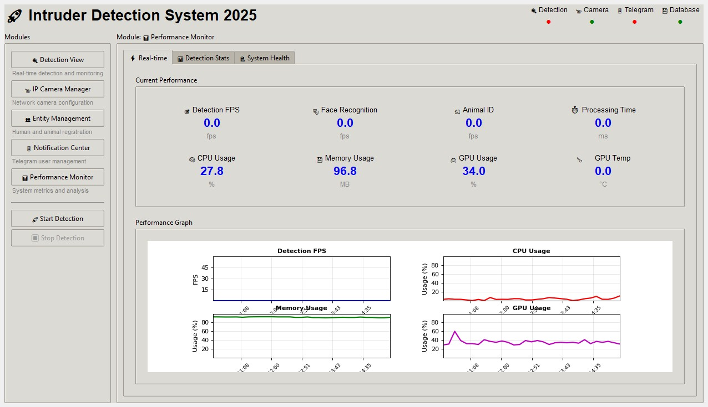
*Real-time intruder detection with live camera feed and AI-powered recognition*

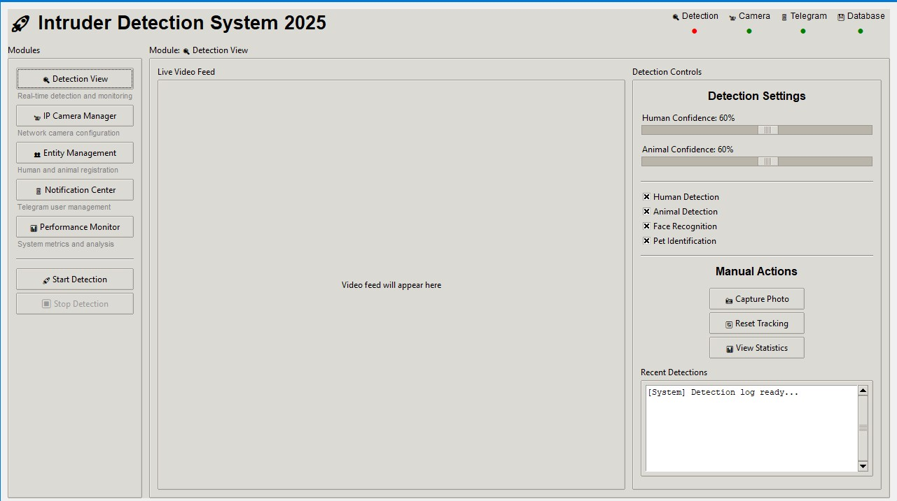
*Comprehensive detection dashboard with system monitoring and controls*

## 📋 Project Overview

An advanced, low-budget intruder detection system providing real-time human and animal detection with intelligent face recognition capabilities for Windows 11.

### **Core Features**
- 🔍 **Human Detection**: YOLO11n for fast, accurate detection with person tracking
- 🎭 **Face Recognition**: Single-threaded multi-face recognition with configurable confidence thresholds
- 🐕 **Advanced Animal Recognition**: 8 animal types with color-based familiar pet identification
- 📹 **IP Camera Support**: Full network camera management with HTTP/HTTPS protocols
- 📱 **Bidirectional Telegram Bot**: Multi-user notifications with command listening
- 🖥️ **Comprehensive GUI**: 5-module interface with real-time controls
- 💾 **SQLite Database**: Lightweight storage with full CRUD operations
- ⚡ **GPU Acceleration**: CUDA/TensorRT optimization
- 📊 **Performance Monitoring**: Real-time metrics and resource utilization tracking
- 🎯 **Smart Detection Logic**: Confidence thresholds and timer-based alerts

### **System Requirements**

#### **Minimum Hardware**
- **GPU**: GTX 1060 6GB+ / RTX 3050
- **CPU**: Intel i5-8400 / AMD Ryzen 5 3600
- **RAM**: 8GB DDR4
- **Storage**: 10GB free space
- **OS**: Windows 11 (64-bit)

#### **Recommended Hardware**
- **GPU**: RTX 3060 12GB+ / RTX 4060
- **CPU**: Intel i5-12400 / AMD Ryzen 5 5600X
- **RAM**: 16GB DDR4
- **Storage**: 20GB SSD

## 📁 Clean Project Structure

```
Intruder Detection System/
├── 📄 README.md               # Project documentation
├── 📄 main.py                 # Application entry point
├── 📄 requirements.txt        # Python dependencies
├── 📄 setup.py                # Package setup
├── 📄 config.yaml             # Main configuration (no sensitive data)
│
├── 📁 core/                   # Core detection engines
│   ├── detection_engine.py   # YOLO11n integration with person tracking
│   ├── face_recognition.py   # Unified face recognition system
│   ├── animal_recognition.py # Individual pet identification
│   ├── camera_manager.py     # Camera handling and management
│   ├── multi_camera_manager.py # Multi-camera coordination
│   └── notification_system.py # Telegram bot integration
│
├── 📁 gui/                    # Modern GUI interface
│   ├── main_window.py         # Main dashboard
│   ├── detection_view.py      # Real-time detection display
│   ├── ip_camera_manager.py   # Camera configuration GUI
│   ├── entity_management.py   # Face/pet registration GUI
│   ├── notification_center.py # Telegram management GUI
│   └── performance_monitor.py # System metrics GUI
│
├── 📁 config/                 # Configuration management
│   ├── settings.py            # System settings with env var support
│   ├── env_config.py          # Secure environment configuration
│   ├── camera_config.py       # Camera configurations
│   └── detection_config.py    # Detection parameters
│
├── 📁 database/               # SQLite database layer
│   ├── database_manager.py    # Database operations
│   ├── models.py              # Database schemas
│   ├── sqlite_schema.sql      # Database schema definition
│   └── migrations/            # Schema migration scripts
│
├── 📁 utils/                  # Utilities and helpers
│   ├── image_processing.py    # Image processing utilities
│   ├── gpu_optimization.py    # CUDA/TensorRT optimization
│   ├── performance_tracker.py # Performance monitoring
│   └── logger.py              # Logging system
│
├── 📁 scripts/                # Setup and utility scripts
│   ├── install.py             # Automated installation
│   ├── setup_secure_config.py # Interactive secure setup
│   ├── check_dependencies.py  # Dependency validation
│   └── setup_environment.py   # Environment configuration
│
├── 📁 tests/                  # Comprehensive testing suite
│   ├── test_detection.py      # Detection system tests
│   ├── test_integration.py    # End-to-end integration tests
│   ├── test_security.py       # Security and config tests
│   └── run_tests.py           # Test orchestration
│
├── 📁 docs/                   # Complete documentation
│   ├── INSTALLATION.md        # Setup instructions
│   ├── SECURITY.md            # Security best practices
│   ├── CHANGELOG.md           # Version history
│   ├── DEVELOPMENT.md         # Development guide
│   ├── CAMERA_SETUP.md        # Camera configuration
│   └── TELEGRAM_SETUP.md      # Bot setup guide
│
├── 📁 models/                 # AI models and weights
│   ├── yolo11n.pt             # YOLO11n model weights
│   ├── yolo11n.onnx           # ONNX optimized model
│   └── deploy.prototxt        # Face detection model config
│
├── 📁 data/                   # Data storage
│   ├── faces/                 # Known face images
│   ├── animals/               # Known pet images
│   ├── detections/            # Detection results
│   └── backups/               # Database backups
│
└── 📁 dependencies/           # External dependencies
    └── dlib-19.24.99-cp312-cp312-win_amd64.whl
```

## 🚀 Quick Start

For complete installation instructions, see **[INSTALLATION.md](docs/INSTALLATION.md)**

### Quick Setup
```bash
# 1. Clone and install dependencies
git clone <repository-url>
cd intruder_detection_system
python scripts/install.py

# 2. Set up secure configuration (IMPORTANT)
python scripts/setup_secure_config.py

# 3. Run the system
python main.py
```

**First time?** Follow the detailed **[Installation Guide](docs/INSTALLATION.md)** for dependency setup.

**Security Note:** The system now uses environment variables for sensitive data like Telegram bot tokens. Never commit `.env` files to version control!

## 📖 Documentation

- **[Installation Guide](docs/INSTALLATION.md)** - Complete setup instructions
- **[Security Guide](docs/SECURITY.md)** - Security best practices and environment variable setup
- **[Development Guide](docs/DEVELOPMENT.md)** - Development workflow
- **[API Documentation](docs/API.md)** - Code reference
- **[Camera Setup Guide](docs/CAMERA_SETUP.md)** - IP camera configuration
- **[Telegram Bot Setup](docs/TELEGRAM_SETUP.md)** - Bot configuration and user management
- **[Database Migration](docs/DATABASE_MIGRATION.md)** - MariaDB to SQLite migration guide

## 🖥️ **GUI Modules Overview**

### **Main Dashboard**
- **Real-time Video Feed**: Live camera stream with detection overlays
- **System Status**: Connection status, performance metrics, active detections
- **Quick Controls**: Manual photo capture, detection toggles, emergency alerts


*Real-time detection interface showing live camera feed with detection overlays*


*Main detection dashboard with system controls and status monitoring*

### **IP Camera Manager**
- **Camera Configuration**: Protocol, IP address, port, URL suffix settings
- **Connection Testing**: Real-time connectivity verification
- **Status Management**: Enable/disable cameras, view connection history
- **Fallback Settings**: Local camera configuration when network fails

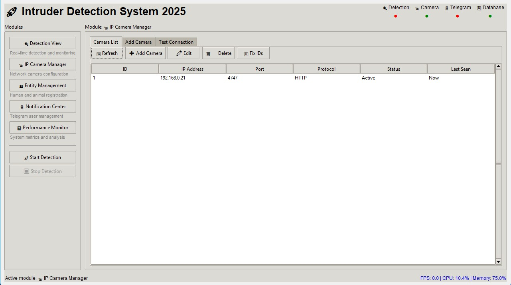
*IP Camera management interface showing connected cameras*

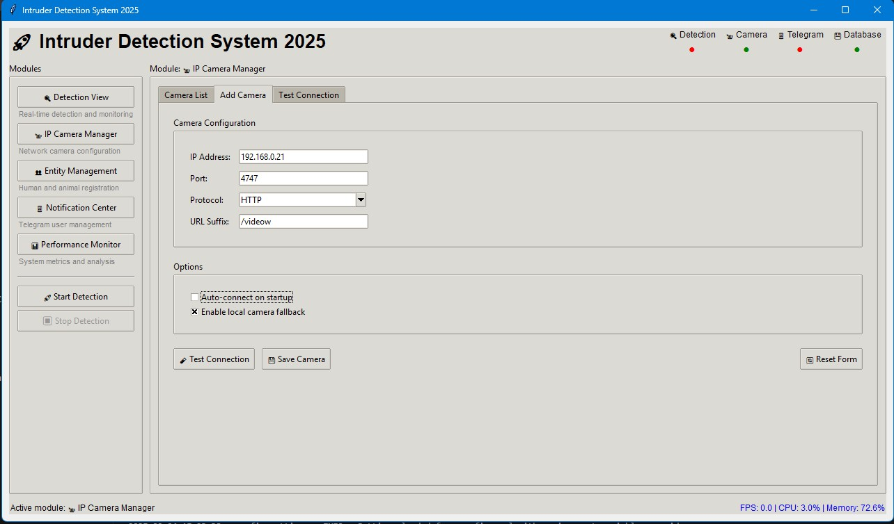
*Adding new IP camera with configuration settings*

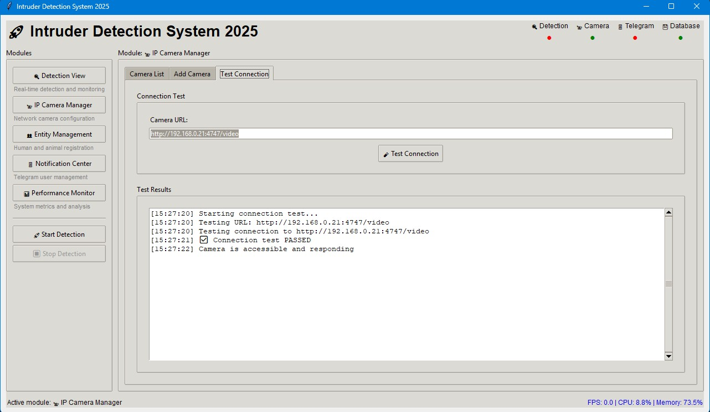
*Testing IP camera connectivity and configuration*

### **Entity Management**
- **Human Registration**: Face image upload, name assignment, ID management
- **Animal Registration**: Pet photos, color selection, animal type classification
- **Bulk Operations**: Import/export entity data, batch processing
- **Image Validation**: Face detection verification, image quality checks

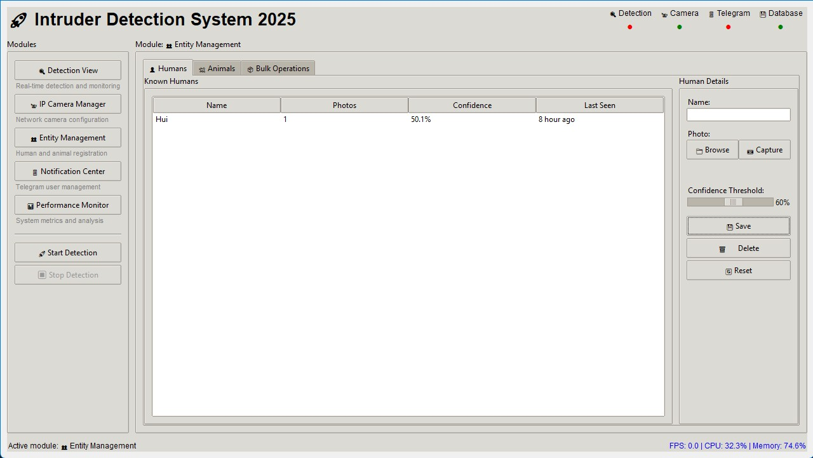
*Human entity management interface for face registration and ID assignment*

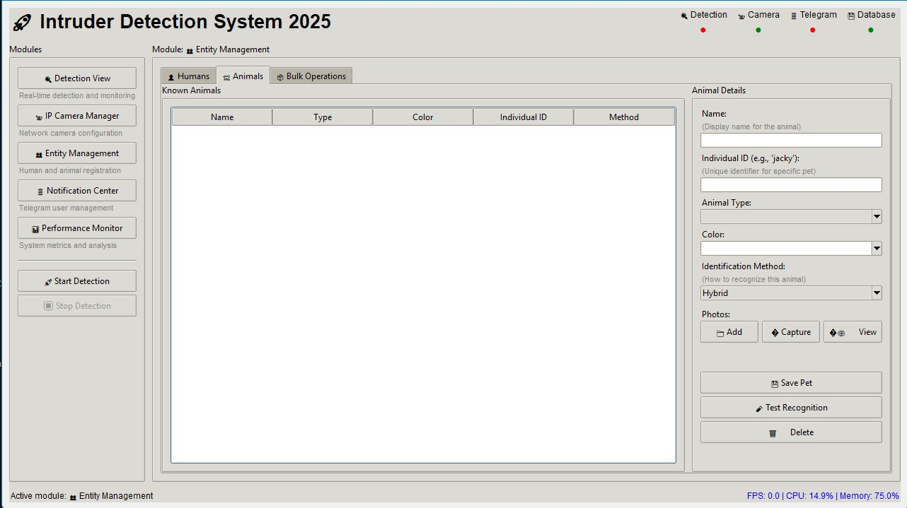
*Animal entity management for pet registration and classification*

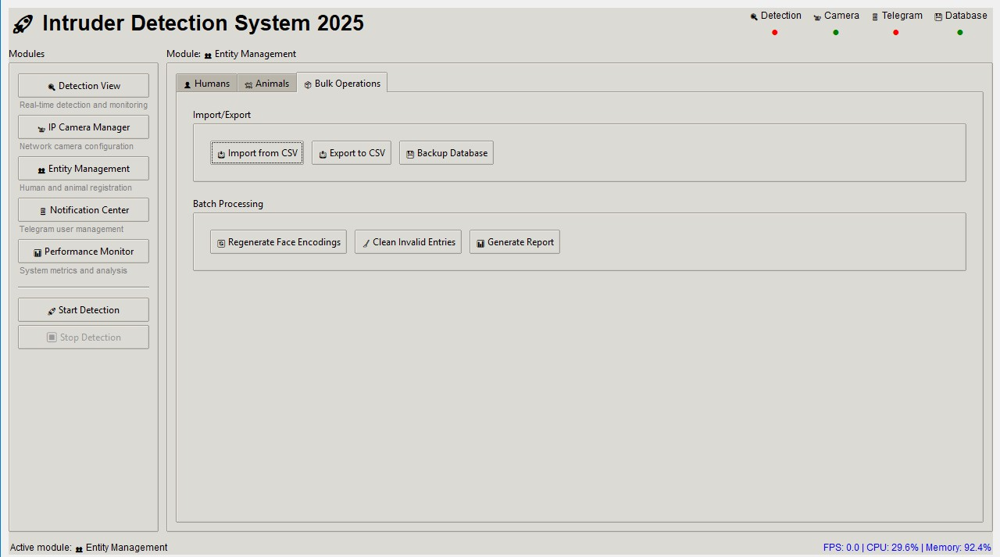
*Bulk operations interface for batch processing of entities*

### **Notification Center**
- **Telegram User Management**: Chat ID registration, username tracking
- **Permission Settings**: Individual notification preferences per user
- **Bot Configuration**: Token management, command setup, help system
- **Test Functionality**: Send test messages, verify bot connectivity

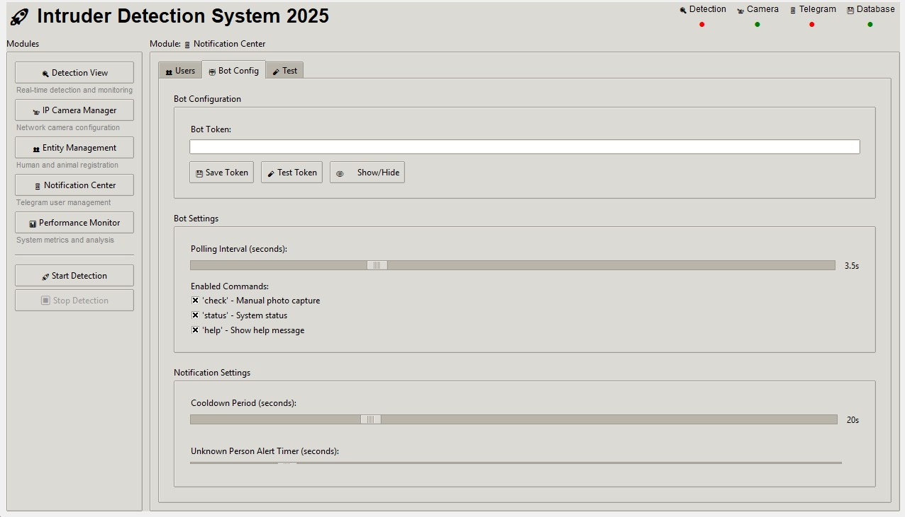
*Telegram bot configuration interface with token management*

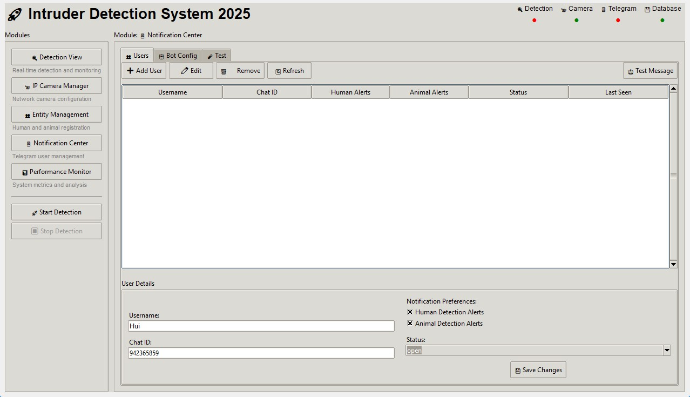
*User management for Telegram notifications with permission settings*

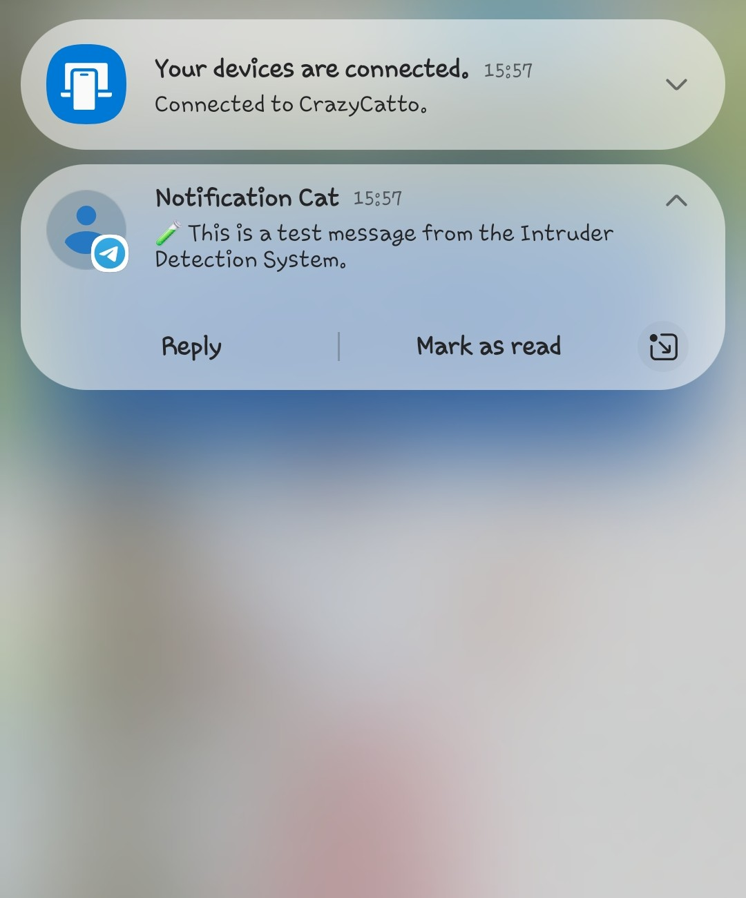
*Testing notification functionality - sending test messages*

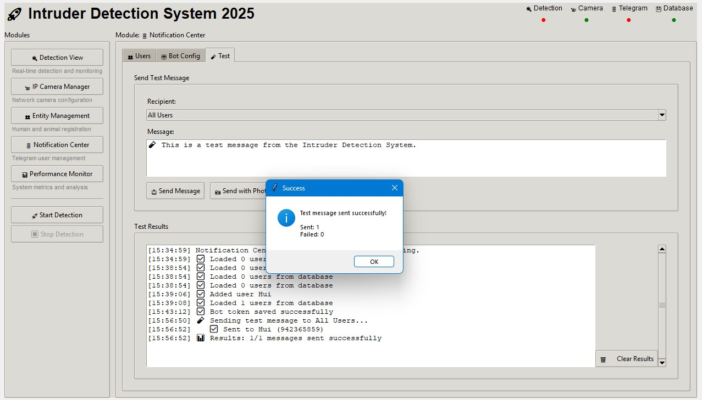
*Notification test results and bot connectivity verification*

### **Performance Monitor**
- **Real-time Metrics**: FPS, processing times, resource utilization
- **Detection Statistics**: Accuracy rates, false positive/negative tracking
- **System Health**: Memory usage, GPU utilization, network status
- **Historical Data**: Performance trends, optimization recommendations

## 💾 **Database Schema (SQLite)**

### **Core Tables**
```sql
-- IP Camera devices
CREATE TABLE devices (
    id INTEGER PRIMARY KEY AUTOINCREMENT,
    ip_address TEXT NOT NULL,
    port INTEGER NOT NULL,
    use_https BOOLEAN DEFAULT FALSE,
    end_with_video BOOLEAN DEFAULT FALSE,
    status TEXT DEFAULT 'active' CHECK(status IN ('active', 'inactive'))
);

-- Known humans and animals with pet identification
CREATE TABLE whitelist (
    id INTEGER PRIMARY KEY AUTOINCREMENT,
    name TEXT NOT NULL,
    entity_type TEXT NOT NULL CHECK(entity_type IN ('human', 'animal')),
    familiar TEXT DEFAULT 'familiar' CHECK(familiar IN ('familiar', 'unfamiliar')),
    color TEXT,
    coco_class_id INTEGER,
    image_path TEXT NOT NULL,
    individual_id TEXT,                -- For specific pet identification (e.g., 'jacky')
    pet_breed TEXT,                    -- Pet breed information
    identification_method TEXT DEFAULT 'color' CHECK(identification_method IN ('color', 'face', 'hybrid'))
);

-- Telegram notification settings
CREATE TABLE notification_settings (
    id INTEGER PRIMARY KEY AUTOINCREMENT,
    chat_id INTEGER NOT NULL UNIQUE,
    telegram_username TEXT NOT NULL,
    notify_human_detection BOOLEAN NOT NULL,
    notify_animal_detection BOOLEAN NOT NULL,
    sendstatus TEXT DEFAULT 'open' CHECK(sendstatus IN ('open', 'close'))
);
```

## 🔧 Development

### Prerequisites
- Python 3.9+ (3.11 recommended)
- NVIDIA GPU with CUDA support
- Visual Studio Build Tools (Windows)
- Git
- SQLite 3.x

### Development Setup
```bash
python -m venv venv
venv\Scripts\activate
python scripts/install.py --dev
python scripts/migrate_database.py  # Set up SQLite database
```

## 🎯 **Key Features Detailed**

### **🔍 Advanced Human Detection**
- **Multi-face Detection**: Simultaneous detection and recognition of multiple faces
- **Person Tracking**: IoU-based tracking across frames
- **Configurable Confidence**: User-adjustable confidence thresholds via software interface
- **Identity Assignment**: Prevents duplicate identity assignments
- **Timer-based Alerts**: 5-second unknown person detection

### **🐕 Intelligent Animal Recognition**
- **8 Animal Types**: cat, dog, horse, sheep, cow, elephant, bear, zebra
- **Individual Pet Identification**: Recognize specific pets (e.g., "Jacky" the dog) using advanced face recognition
- **Color Detection**: HSV-based analysis (white, black, yellow, brown, beige, gray)
- **Familiar Pet Database**: Known animals with individual identification and color matching
- **Smart Color Matching**: Similarity detection (yellow ≈ beige, brown ≈ beige)
- **Configurable Confidence**: User-adjustable confidence thresholds for both detection and identification

### **📹 IP Camera Management**
- **Protocol Support**: HTTP and HTTPS connections
- **Flexible Configuration**: Custom IP, port, and URL suffix settings
- **Status Management**: Active/Inactive camera control
- **Automatic Fallback**: Local camera (index 0) when network fails
- **Connection Testing**: Built-in camera connectivity verification

### **📱 Bidirectional Telegram Bot**
- **Multi-user Support**: Individual chat IDs with custom permissions
- **Command Listening**: Responds to "check" commands for manual capture
- **Notification Types**: Separate settings for human/animal detection
- **User Management**: Add/modify/delete users with status control
- **Test Functionality**: Send test messages to verify setup

### **📊 Real-time Performance Monitoring**
- **Processing Metrics**: YOLO detection, face recognition, animal identification times
- **Resource Tracking**: CPU, Memory, GPU utilization monitoring
- **Frame Analysis**: Per-frame performance breakdown
- **Research Metrics**: Accuracy, false positive/negative rates

## 📊 Performance Targets

| Component | Target Performance | Monitoring |
|-----------|-------------------|------------|
| Object Detection | 25-35 FPS (RTX 3050+) | Real-time FPS tracking |
| Face Recognition | <100ms per face | Per-face timing |
| Animal Recognition | <50ms per animal | Color analysis timing |
| Memory Usage | <2GB VRAM | GPU utilization monitoring |
| Startup Time | <30 seconds | System initialization tracking |
| Notification Delay | <5 seconds | End-to-end latency measurement |
| IP Camera Connection | <3 seconds | Network connectivity testing |

## 🤝 Contributing

1. Fork the repository
2. Create feature branch (`git checkout -b feature/amazing-feature`)
3. Commit changes (`git commit -m 'Add amazing feature'`)
4. Push to branch (`git push origin feature/amazing-feature`)
5. Open Pull Request

## 📄 License

This project is licensed under the MIT License - see the [LICENSE](LICENSE) file for details.

**Version**: 1.0.0  
**Last Updated**: January 2025  
**Platform**: Windows 11  
**Author**: Development Team
